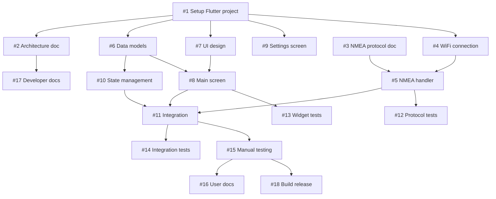

# Autohelm App - MVP Implementation Plan

## Overview

This document outlines the implementation plan for the Minimum Viable Product (MVP) of the Autohelm mobile application. The app emulates the Autohelm remote control functionality for changing a vessel's Course Over Ground (COG) using NMEA0183 protocol over WiFi.

## Target Platform

- **Framework**: Flutter (cross-platform: iOS & Android)
- **Protocol**: NMEA0183 over WiFi
- **Hardware**: Yacht Device WiFi Gateway (https://www.yachtd.com/products/wifi_0183_gateway.html)

## MVP Requirements

### Core Functionality
1. Display current COG (Course Over Ground)
2. Adjust COG by +1 degree
3. Adjust COG by -1 degree
4. Adjust COG by +10 degrees
5. Adjust COG by -10 degrees
6. UI that mimics the physical Autohelm remote control (see docs/real.jpg)

### Technical Requirements
1. NMEA0183 protocol implementation
2. WiFi connectivity to Yacht Device Gateway
3. Real-time COG display updates
4. Cross-platform compatibility (iOS & Android)

## Implementation Phases

### Phase 1: Project Foundation (Estimated: 2-3 days)

**Issues to Create:**
1. **Setup Flutter project structure** (feature)
   - Initialize Flutter project
   - Configure dependencies (pubspec.yaml)
   - Set up project directory structure
   - Configure for iOS and Android targets
   
2. **Create architecture documentation** (documentation)
   - Document application architecture
   - Create system diagram (components, data flow)
   - Define module boundaries
   - Document state management approach
   
3. **Document NMEA0183 protocol requirements** (documentation)
   - Research and document NMEA0183 sentences for autopilot
   - Identify required NMEA sentences (likely APB, APA, or proprietary)
   - Document message formats for COG commands
   - Document Yacht Device Gateway connection specs

### Phase 2: Network & Protocol Layer (Estimated: 3-4 days)

**Issues to Create:**
4. **Implement WiFi connection manager** (feature)
   - Depends on: #1 (project setup)
   - Create connection service to Yacht Device Gateway
   - Handle connection state (connected, disconnected, error)
   - Implement reconnection logic
   - Add connection status indicators
   
5. **Implement NMEA0183 protocol handler** (feature)
   - Depends on: #3 (protocol documentation), #4 (WiFi connection)
   - Parse incoming NMEA sentences
   - Validate NMEA message checksums
   - Extract COG data from sentences
   - Format outgoing COG adjustment commands
   
6. **Create data models** (feature)
   - Depends on: #1 (project setup)
   - Define COG data model
   - Define connection state model
   - Define command/response models

### Phase 3: User Interface (Estimated: 3-4 days)

**Issues to Create:**
7. **Design UI matching Autohelm remote** (feature)
   - Depends on: #1 (project setup)
   - Create wireframes based on docs/real.jpg
   - Design button layout (+1, -1, +10, -10)
   - Design COG display area
   - Define color scheme and styling
   
8. **Implement main control screen** (feature)
   - Depends on: #7 (UI design), #6 (data models)
   - Build COG display widget
   - Create adjustment button widgets
   - Implement button press handlers
   - Add visual feedback for button presses
   
9. **Implement settings screen** (feature)
   - Depends on: #1 (project setup)
   - WiFi gateway IP/hostname configuration
   - Port configuration
   - Connection timeout settings
   - Save/load settings

### Phase 4: Integration & State Management (Estimated: 2-3 days)

**Issues to Create:**
10. **Implement state management** (feature)
    - Depends on: #6 (data models)
    - Set up state management solution (Provider/Riverpod/Bloc)
    - Connect UI to data layer
    - Handle state updates from NMEA messages
    - Manage command state (pending, sent, confirmed)
    
11. **Integrate UI with protocol layer** (feature)
    - Depends on: #8 (main screen), #5 (NMEA handler), #10 (state management)
    - Connect button presses to NMEA commands
    - Update display from incoming NMEA data
    - Handle command feedback
    - Implement error handling UI

### Phase 5: Testing (Estimated: 3-4 days)

**Issues to Create:**
12. **Add unit tests for protocol layer** (feature)
    - Depends on: #5 (NMEA handler)
    - Test NMEA parsing logic
    - Test message validation
    - Test COG calculation
    - Test error handling
    
13. **Add widget tests for UI** (feature)
    - Depends on: #8 (main screen)
    - Test button interactions
    - Test display updates
    - Test settings screen
    - Test navigation
    
14. **Add integration tests** (feature)
    - Depends on: #11 (integration)
    - Test complete user flows
    - Test connection scenarios
    - Test command/response cycles
    
15. **Manual testing with hardware** (bug)
    - Depends on: #11 (integration)
    - Test with actual Yacht Device Gateway
    - Validate NMEA commands are correct
    - Test on physical devices (iOS & Android)
    - Document any issues found

### Phase 6: Documentation & Finalization (Estimated: 2 days)

**Issues to Create:**
16. **Create user documentation** (documentation)
    - Depends on: #15 (manual testing)
    - Setup instructions
    - Usage guide
    - Troubleshooting guide
    - Screenshots
    
17. **Create developer documentation** (documentation)
    - Depends on: #2 (architecture doc)
    - Code documentation
    - Build instructions
    - Testing guide
    - Contributing guidelines
    
18. **Build release artifacts** (feature)
    - Depends on: #15 (manual testing)
    - Configure release builds (iOS & Android)
    - Create app icons
    - Set up signing (if applicable)
    - Generate APK/IPA files

## Dependencies Graph

## Issue Tags

- **feature**: New functionality implementation
- **documentation**: Documentation tasks
- **bug**: Issues found during testing
- **blocked**: Waiting on dependencies
- **blocking**: Blocks other issues

## Estimated Timeline

- **Total Duration**: 15-20 working days
- **Phase 1**: Days 1-3
- **Phase 2**: Days 4-7
- **Phase 3**: Days 8-11
- **Phase 4**: Days 12-14
- **Phase 5**: Days 15-18
- **Phase 6**: Days 19-20

## Success Criteria

1. ✅ App successfully connects to Yacht Device Gateway
2. ✅ COG is displayed and updates in real-time
3. ✅ All four adjustment buttons (+1, -1, +10, -10) work correctly
4. ✅ UI closely resembles the physical Autohelm remote
5. ✅ App works on both iOS and Android
6. ✅ All tests pass
7. ✅ Documentation is complete

## Risk Mitigation

1. **NMEA Protocol Uncertainty**: Document protocol early, validate with hardware ASAP
2. **Hardware Availability**: Plan for simulator/mock implementation for development
3. **Cross-platform Issues**: Test on both platforms regularly
4. **Network Reliability**: Implement robust error handling and reconnection logic

## Out of Scope for MVP

- Multiple autopilot support
- Route planning
- Waypoint management
- Advanced autopilot modes
- Bluetooth connectivity
- Data logging/history
- Offline mode
